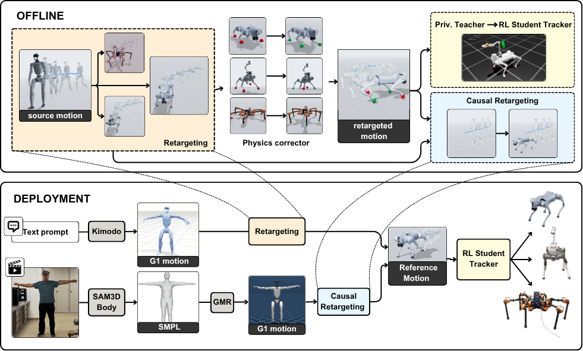

# X-Morph: Cross-Morphology Motion Retargeting

<p align="center">
  <a href="https://maker-rat.github.io/morph/">
    
  </a>
</p>

<p align="center">
  <a href="https://maker-rat.github.io/morph/"><strong>Project Page</strong></a>
  &nbsp;|&nbsp;
  <a href="https://arxiv.org/abs/2606.30290"><strong>Paper</strong></a>
</p>

X-Morph learns deployable motion references for robots whose morphology differs substantially from a human. This repository contains the retargeting teacher, offline physics corrector, and causal student used for G1-to-Go2, G1-to-Yuna hexapod, and G1-to-B2--Z1 quadruped-manipulator transfer. The commands below use **G1 humanoid -> Go2 quadruped locomotion** as the minimal running example; the same pipeline is configured for the other targets under `configs/`.

The usual workflow is:

```text
G1 PKLs + Go2 PKLs -> processed stats/windows -> teacher
G1 PKLs -> teacher -> corrector/skate-comp -> cleaned Go2 PKLs
paired G1 PKLs + cleaned Go2 PKLs -> RT student
```

The current teacher/corrector pipeline supports both a yaw-only root angular features and a newer rpy/body-angular-velocity representation.

## Related Repositories

- [`kimodo_morph`](https://github.com/Maker-Rat/kimodo_morph): text-conditioned G1 generation followed by X-Morph retargeting
- [`video2morph`](https://github.com/Maker-Rat/video2morph): real-time monocular video-to-X-Morph reference publishing

## Supported Configurations

| Source | Target | Task configurations |
| --- | --- | --- |
| Unitree G1 | Unitree Go2 | locomotion, manipulation |
| Unitree G1 | Yuna hexapod | locomotion, mixed locomotion/manipulation |
| Unitree G1 | Unitree B2 + Z1 arm | locomotion, manipulation |
| Unitree G1 | Go2 with D1 or custom arm | manipulation |

Robot assets, motion data, processed datasets, pair configurations, and the
trained X-Morph teacher, corrector, and causal-student runs are included. The
downstream robot tracking policies are maintained in their respective control
repositories and are not part of this repository.

## Pretrained Runs

The released checkpoints are stored under [`runs/`](runs/). Use the causal
student's `best.pt` for real-time retargeting. Teachers and correctors implement
the offline reference-generation and physics-cleaning pipeline used to prepare
student training data.

| Target | Motion set | Teacher | Corrector | Causal student |
| --- | --- | --- | --- | --- |
| Go2 | locomotion | [`teacher_loco_g1_go2`](runs/teacher_loco_g1_go2/) | [`corrector_loco_g1_go2`](runs/corrector_loco_g1_go2/) | [`student_loco_g1_go2/best.pt`](runs/student_loco_g1_go2/best.pt) |
| Yuna | locomotion | [`teacher_loco_g1_yuna`](runs/teacher_loco_g1_yuna/) | [`corrector_loco_g1_yuna`](runs/corrector_loco_g1_yuna/) | [`student_loco_g1_yuna/best.pt`](runs/student_loco_g1_yuna/best.pt) |
| Yuna | locomotion + manipulation | [`teacher_mix_g1_yuna`](runs/teacher_mix_g1_yuna/) | [`corrector_mix_g1_yuna`](runs/corrector_mix_g1_yuna/) | [`student_mix_g1_yuna/best.pt`](runs/student_mix_g1_yuna/best.pt) |
| B2--Z1 | locomotion | [`teacher_loco_g1_b2_z1`](runs/teacher_loco_g1_b2_z1/) | -- | -- |
| B2--Z1 | locomotion + manipulation | [`teacher_mix_g1_b2_z1`](runs/teacher_mix_g1_b2_z1/) | [`corrector_mix_g1_b2_z1`](runs/corrector_mix_g1_b2_z1/) | [`student_mix_b2_z1/best.pt`](runs/student_mix_b2_z1/best.pt) |

Each student directory also contains its training configuration and paired-data
metadata. The commands below show how to reproduce the runs from scratch or use
the released checkpoints directly.

To keep the repository compact, each teacher includes only its final inference
snapshot (`1800` for Go2 locomotion, `2200` for B2--Z1 locomotion, `3000` for
Yuna locomotion and B2--Z1 mixed motion, and `2600` for Yuna mixed motion).
Student and corrector directories retain `best.pt` and `last.pt`. Optimizer
histories and training logs are intentionally omitted; the released teacher
runs support inference, but not resuming their original training sessions.

## Environment Setup

Clone the repository and create a Python 3.10 environment:

```bash
git clone https://github.com/Maker-Rat/morph.git
cd morph
export XMORPH_ROOT="$(pwd)"
conda create -n morph python=3.10 -y
conda activate morph
pip install -e .
```

This installs the package metadata name `morph`. The runtime module namespace is `csmt`, so commands use `python -m csmt....`.

`XMORPH_ROOT` is the global path used by released run metadata. Set it to the
repository root in each new shell, or add the export above to your shell
configuration. When it is unset, X-Morph infers the root from the installed
`csmt` package. Paths stored as `${XMORPH_ROOT}/...` are expanded automatically
when run metadata is loaded.

If you need CUDA-specific PyTorch wheels, reinstall `torch` after this step using the official PyTorch command for your CUDA version.

## Repository Layout

- `assets/robots/`: robot XML assets
- `assets/fk/`: stripped FK XMLs used by PyTorch Kinematics
- `configs/robots/*.yaml`: robot metadata, joint limits, nominal base height, XML paths
- `configs/tasks/<family>/defaults.yaml`: task-level defaults
- `configs/tasks/<family>/pairs/*.yaml`: pair-specific correspondences and losses
- `configs/models/*.yaml`: teacher, corrector, and student model configs
- `src/csmt/pipelines/`: dataset, training, inference, visualization utilities
- `data/raw/`, `data/student/`: robot motion data and paired student-training clips
- `data/processed/`: precomputed windowed datasets and normalization statistics
- `runs/`: released teacher, physics-corrector, and causal-student checkpoints

## 1) Robot And Pair Setup

The G1 -> Go2 locomotion pair is expected to exist as:

```text
configs/robots/g1.yaml
configs/robots/go2.yaml
configs/tasks/locomotion/pairs/g1_to_go2.yaml
```

To bootstrap a new robot config from XML:

```bash
python -m csmt.tools.bootstrap_robot_from_xml \
  --xml ./assets/robots/unitree_go2/go2.xml \
  --robot-id go2 \
  --output-root .
```

To bootstrap a new pair:

```bash
python -m csmt.tools.bootstrap_task_pair \
  --output-root . \
  --task-family locomotion \
  --pair-id g1_to_go2 \
  --src-robot g1 \
  --dst-robot go2
```

After bootstrapping, edit the pair YAML manually for body/foot correspondences and loss weights. Also validate the robot nominal base height in the robot YAML.

## 2) Create Processed Dataset

Use this for teacher training and for robot statistics used by inference, corrector, and student code.

```bash
python -m csmt.pipelines.create_dataset \
  --output-root . \
  --task-family locomotion \
  --pair-id g1_to_go2 \
  --src-pkl-dir ./data/raw/g1/locomotion \
  --dst-pkl-dir ./data/raw/go2/locomotion \
  --processed-dir ./data/processed/loco_g1_go2 \
  --window-size 64 \
  --stride 20
```

The processed directory contains per-robot normalization stats such as `g1_stats.npz` and `go2_stats.npz`. Keep `--processed-dir` consistent between teacher, corrector, student, and inference.

Root angular representation:

```text
--root-ang-features yaw   # legacy: root angular feature is yaw rate only
--root-ang-features rpy   # current: root angular feature is body angular velocity wx, wy, wz
```

Use one representation consistently for a run family. If you create an rpy processed dataset, train the teacher/corrector/students against that processed directory and use rpy-compatible inference flags where applicable.

## 3) Train Teacher

```bash
python -m csmt.pipelines.train_teacher \
  --output-root . \
  --processed-dir ./data/processed/loco_g1_go2 \
  --task-family locomotion \
  --pair-id g1_to_go2 \
  --save-dir ./runs/teacher_loco_g1_go2 \
  --device cuda:0 \
  --batch-size 128 \
  --epoch-num 3000
```

Teacher runs should contain `refactor_teacher_run.json`; legacy teacher dirs without it are not supported by the current inference utilities.

Teacher loss knobs are usually configured in the pair YAML under `loss_overrides` or passed with `--set key=value`. Useful current knobs:

- `retar_vel_matching`: `direct`, `mapping`, or disabled velocity matching mode
- `retar_vel_src_vmax_percentile`, `retar_vel_dst_vmax_percentile`: robust speed scales for mapping mode
- `retar_vel_deadzone`: near-zero speed deadzone for standstill stability
- `retar_vel_map_z`: whether vertical velocity participates in mapped speed matching
- `lambda_retar_roll_rate`, `lambda_retar_pitch_rate`, `lambda_retar_yaw_rate`: separate root angular-rate matching weights for rpy datasets
- `retar_yaw_rate_scale`: fixed scale applied to source yaw/body-z angular rate before yaw-rate matching; `1.0` preserves old behavior, values below/above 1 damp or amplify target turning pressure
- `lambda_cycle_latent`, `lambda_cycle_fk`, `lambda_cycle_motion`: separated cycle losses
- `lambda_skating`, `lambda_grounding`, `ground_margin`: teacher physics losses; these can often be kept lighter if a corrector is used later

Example override:

```bash
python -m csmt.pipelines.train_teacher \
  --output-root . \
  --processed-dir ./data/processed/loco_g1_go2_rpy \
  --task-family locomotion \
  --pair-id g1_to_go2 \
  --save-dir ./runs/teacher_loco_g1_go2_rpy \
  --device cuda:0 \
  --set retar_vel_matching=mapping \
  --set retar_vel_src_vmax_percentile=80.0 \
  --set retar_vel_dst_vmax_percentile=99.0 \
  --set lambda_retar_yaw_rate=5.0 \
  --set retar_yaw_rate_scale=0.75
```

## 4) Teacher Inference

Single clip:

```bash
python -m csmt.pipelines.infer_teacher \
  --output-root . \
  --processed-dir ./data/processed/loco_g1_go2 \
  --task-family locomotion \
  --pair-id g1_to_go2 \
  --teacher-dir ./runs/teacher_loco_g1_go2 \
  --input-pkl ./data/raw/g1/locomotion/walk1_subject1.pkl \
  --output-pkl ./demo_output/teacher_go2.pkl \
  --device cuda:0 \
  --dst-start-height 0.28 \
  --save-src-debug
```

Batch mode:

```bash
python -m csmt.pipelines.infer_teacher \
  --output-root . \
  --processed-dir ./data/processed/loco_g1_go2 \
  --task-family locomotion \
  --pair-id g1_to_go2 \
  --teacher-dir ./runs/teacher_loco_g1_go2 \
  --input-pkl-dir ./data/student/loco_g1_go2/g1 \
  --output-pkl-dir ./data/student/loco_g1_go2/go2 \
  --device cuda:0 \
  --dst-start-height 0.28 \
  --no-save-src-debug
```

Useful final-cleaning flags:

```text
--corrector-ckpt ./runs/corrector_loco_g1_go2/best.pt
--apply-root-skate-comp
--root-rotation-mode rpy
```

If both are used, the output order is:

```text
teacher -> corrector -> root skate compensation -> saved Go2 PKL
```

Use `--root-rotation-mode rpy` for rpy teachers/correctors if you want exported root orientation to include roll and pitch. Use `yaw` if you intentionally want yaw-only output/viewing.

## 5) Corrector: Offline Teacher Cleanup

The corrector is an offline post-processor for teacher outputs. Use it to clean teacher-generated Go2 data before training students or downstream tracking policies.

The current corrector operates on long source PKL clips in memory:

```text
source G1 PKL -> teacher Go2 output -> corrector residual -> cleaned Go2 PKL
```

It does **not** train from prebuilt NPZ windows. During training it loads source PKLs from `--src-pkl-dir`, runs the teacher once per clip, caches the teacher output, and learns residual corrections over variable-length sequences.

### 5.1 Train Corrector

Full-clip training:

```bash
python -m csmt.pipelines.train_corrector \
  --output-root . \
  --processed-dir ./data/processed/loco_g1_go2 \
  --task-family locomotion \
  --pair-id g1_to_go2 \
  --teacher-dir ./runs/teacher_loco_g1_go2 \
  --src-pkl-dir ./data/student/loco_g1_go2/g1 \
  --save-dir ./runs/corrector_loco_g1_go2 \
  --device cuda:0 \
  --max-frames 0 \
  --train-seq-len 0 \
  --eval-seq-len 0 \
  --wandb
```

For very long clips, cap frames or crop training windows:

```bash
python -m csmt.pipelines.train_corrector \
  --output-root . \
  --processed-dir ./data/processed/loco_g1_go2 \
  --task-family locomotion \
  --pair-id g1_to_go2 \
  --teacher-dir ./runs/teacher_loco_g1_go2 \
  --src-pkl-dir ./data/student/loco_g1_go2/g1 \
  --save-dir ./runs/corrector_loco_g1_go2 \
  --device cuda:0 \
  --max-frames 3000 \
  --train-seq-len 1024 \
  --eval-seq-len 0 \
  --wandb
```

Main config:

```text
configs/models/corrector.yaml
```

Important config/CLI knobs:

- `joint_delta_max`: max residual on target joint angles
- `root_pos_delta_max`: max residual on root trajectory position
- `yaw_delta_max`, `root_rot_delta_max`: max residual on yaw-only or roll/pitch/yaw trajectory channels
- `correct_root_motion`: master switch for root trajectory correction
- `correct_root_xy`, `correct_root_z`, `correct_root_roll`, `correct_root_pitch`, `correct_root_yaw`: independently enable/disable root channels
- `lambda_preserve_joints`: keeps corrected joints close to teacher joints
- `lambda_preserve_root_vel_xy`, `lambda_preserve_root_vel_z`: preserve teacher root local velocity while still allowing direct root-position correction
- `lambda_preserve_root_roll_pitch_rate`, `lambda_preserve_root_yaw_rate`: preserve teacher root angular rates in rpy/yaw space
- `lambda_base_level`: optional level-base penalty for rpy datasets
- `lambda_grounding`: penalizes floating/penetration during source-gated contact windows
- `lambda_skating`: penalizes stance-foot sliding
- `lambda_smooth`: temporal smoothness on residuals
- `lambda_smooth_joint_vel`, `lambda_smooth_joint_acc`: optional joint velocity/acceleration smoothness
- `ground_margin`: foot height margin for grounding
- `physics_ref_frames`: number of initial frames used for physics/reference estimates

The key design choice is that root correction is trajectory-based: the model edits root position and optional roll/pitch/yaw directly, while preserve-root losses compare the resulting velocities/angular rates against the original teacher motion. This avoids cumulative velocity drift while still allowing the corrector to remove long-horizon floating or sinking.

### 5.2 Generate Cleaned Go2 PKLs

After training, use the corrector through teacher inference:

```bash
python -m csmt.pipelines.infer_teacher \
  --output-root . \
  --processed-dir ./data/processed/loco_g1_go2 \
  --task-family locomotion \
  --pair-id g1_to_go2 \
  --teacher-dir ./runs/teacher_loco_g1_go2 \
  --corrector-ckpt ./runs/corrector_loco_g1_go2/best.pt \
  --input-pkl-dir ./data/student/loco_g1_go2/g1 \
  --output-pkl-dir ./data/student/loco_g1_go2/go2 \
  --device cuda:0 \
  --dst-start-height 0.28 \
  --apply-root-skate-comp \
  --no-save-src-debug
```

Recommended data rule: train students on this final cleaned Go2 folder, not on raw teacher outputs if the teacher has visible floating, penetration, or skating artifacts.

## 6) Visualize Motions

Visualize any Go2 PKL:

```bash
python -m csmt.pipelines.visualize_motion \
  --output-root . \
  --robot-id go2 \
  --pkl ./demo_output/teacher_go2.pkl \
  --loop
```

Visualize a frame range:

```bash
python -m csmt.pipelines.visualize_motion \
  --output-root . \
  --robot-id go2 \
  --pkl ./demo_output/teacher_go2.pkl \
  --start-frame 300 \
  --end-frame 600 \
  --loop
```

If teacher inference was run with `--save-contact-debug`, you can overlay contact diagnostics:

```bash
python -m csmt.pipelines.visualize_motion \
  --output-root . \
  --robot-id go2 \
  --pkl ./demo_output/teacher_go2.pkl \
  --contact-debug-npz ./demo_output/teacher_go2_contact_debug.npz \
  --loop
```

Viewer controls:

```text
space: pause/play
r: reset
c: toggle contact overlay, if available
```

## 7) RT Student: Paired G1 PKL -> Cleaned Go2 PKL

This is the normal real-time student. It consumes G1-style robot features and predicts Go2 references. It is the path used when the live system still goes through GMR:

```text
video/camera -> FastSAM SMPL -> GMR G1 PKL/frame -> RT student -> Go2
```

Expected paired folders:

```text
data/student/loco_g1_go2/
  g1/
    clip_0001.pkl
    clip_0002.pkl
  go2/
    clip_0001.pkl
    clip_0002.pkl
```

Pairing rule: `g1/<name>.pkl` matches `go2/<name>.pkl` by exact filename.

Train:

```bash
python -m csmt.pipelines.train_student \
  --output-root . \
  --processed-dir ./data/processed/loco_g1_go2 \
  --task-family locomotion \
  --pair-id g1_to_go2 \
  --src-pkl-dir ./data/student/loco_g1_go2/g1 \
  --dst-pkl-dir ./data/student/loco_g1_go2/go2 \
  --save-dir ./runs/student_loco_g1_go2 \
  --device cuda:0 \
  --epochs 25 \
  --batch-size 256
```

Main config:

```text
configs/models/student_rt.yaml
```

Important knobs:

- `balanced_sampling`: samples clips more evenly so long clips do not dominate
- `samples_per_epoch`: `0` means use the full train-window count
- `prev_context_mode`: `student` is usually the realistic autoregressive setting
- `y_prev_noise_std`, `y_prev_noise_prob`: robustness to previous-output errors
- `lambda_imitation`: joint imitation weight
- `lambda_src_motion`: root/local velocity supervision weight
- `lambda_smooth`: output smoothness regularization

Run inference:

```bash
python -m csmt.pipelines.infer_student_rt \
  --output-root . \
  --processed-dir ./data/processed/loco_g1_go2 \
  --task-family locomotion \
  --pair-id g1_to_go2 \
  --student-ckpt ./runs/student_loco_g1_go2/best.pt \
  --input-pkl ./data/student/loco_g1_go2/g1/walk1_subject1.pkl \
  --output-pkl ./demo_output/student_rt_go2.pkl \
  --device cuda:0 \
  --root-motion-mode student \
  --dst-start-height 0.28
```

## 8) SMPL Student: Paired SMPL -> Cleaned Go2 PKL

This is the direct SMPL-input student. It skips GMR at inference time:

```text
video/camera -> FastSAM SMPL -> SMPL student -> Go2
```

Expected paired folders:

```text
data/student/loco_smpl_g1_go2/
  smpl/
    clip_0001.npz
    clip_0002.npz
  go2/
    clip_0001.pkl
    clip_0002.pkl
```

Pairing rule: `smpl/<name>.npz` matches `go2/<name>.pkl` by filename stem.

SMPL files should contain the usual AMASS-style arrays:

```text
pose_body:   [T, 63]
root_orient: [T, 3]
trans:       [T, 3]
```

Train:

```bash
python -m csmt.pipelines.train_student_smpl \
  --output-root . \
  --processed-dir ./data/processed/loco_g1_go2 \
  --task-family locomotion \
  --pair-id g1_to_go2 \
  --smpl-dir ./data/student/loco_smpl_g1_go2/smpl \
  --dst-pkl-dir ./data/student/loco_smpl_g1_go2/go2 \
  --save-dir ./runs/student_smpl_g1_go2 \
  --device cuda:0 \
  --epochs 25 \
  --batch-size 256
```

Main config:

```text
configs/models/student_smpl.yaml
```

Current SMPL student details:

- `smpl_input_dim: 69`
- SMPL is resampled to the paired Go2 PKL fps by default
- SMPL input normalization is computed from the paired training set and saved with the checkpoint
- `smpl_root_map: world_z` keeps vertical velocity in world Z, which is usually better for jumps/squats than treating all root velocity as local horizontal motion
- Targets are the final cleaned Go2 PKLs, not teacher outputs generated on the fly

Run inference:

```bash
python -m csmt.pipelines.infer_student_smpl \
  --output-root . \
  --processed-dir ./data/processed/loco_g1_go2 \
  --task-family locomotion \
  --pair-id g1_to_go2 \
  --student-ckpt ./runs/student_smpl_g1_go2/best.pt \
  --input-smpl ./data/student/loco_smpl_g1_go2/smpl/walking_fast01_stageii.npz \
  --output-pkl ./demo_output/student_smpl_go2.pkl \
  --device cuda:0 \
  --root-motion-mode student \
  --target-fps 30 \
  --dst-start-height 0.28
```

## License

The X-Morph software is released under the [Apache License 2.0](LICENSE).
Third-party datasets, model assets, and upstream software retain their original
licenses and are not relicensed under Apache-2.0.

## Data and Upstream Acknowledgements

X-Morph uses or builds upon the following motion-data and retargeting resources:

- [AMASS: Archive of Motion Capture as Surface Shapes](https://amass.is.tue.mpg.de/)
  provides human motion represented with SMPL-family body models. AMASS and its
  constituent datasets remain subject to their respective original terms.
- [LAFAN1](https://github.com/ubisoft/ubisoft-laforge-animation-dataset),
  introduced with *Robust Motion In-betweening*, provides human animation data
  under the
  [CC BY-NC-ND 4.0 license](https://github.com/ubisoft/ubisoft-laforge-animation-dataset/blob/master/license.txt).
- Go2 reference motions were sourced in part from
  [Learning Robot Locomotion from Diverse Datasets](https://github.com/luliuxxx/LearnDiverseQuadLoco).
- Additional Go2 reference motions were sourced from
  [RAMBO: RL-augmented Model-based Whole-body Control for Loco-manipulation](https://github.com/catachiii/rambo),
  whose repository is released under
  [CC BY-NC 4.0](https://github.com/catachiii/rambo#license).
- [OmniRetarget](https://omniretarget.github.io/) is acknowledged as a source of
  interaction-preserving humanoid retargeting data and methodology.
- [GMR: General Motion Retargeting](https://github.com/YanjieZe/GMR) is
  acknowledged for the humanoid motion-retargeting pipeline used in preparing
  source motions.

Please cite the corresponding original works when using data or components
derived from these projects. The repository does not grant redistribution
rights beyond those provided by each original source.
